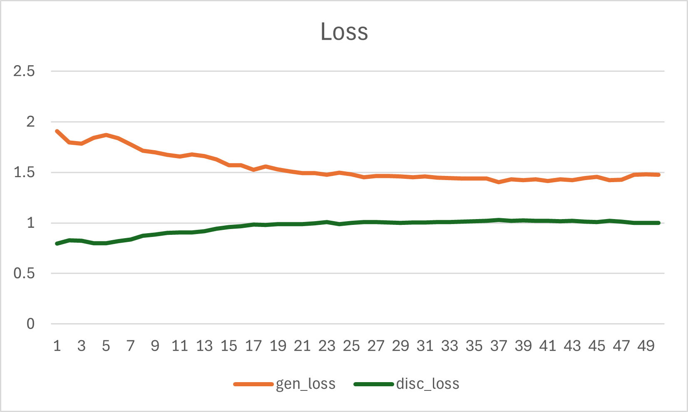
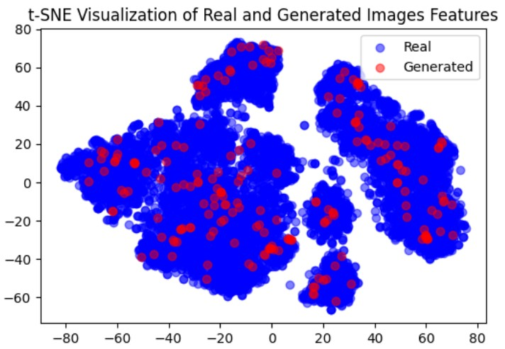

# 🧵 Multi-Branch Conditional GAN on Fashion MNIST

## 🌟 Overview

This repository presents a **Multi-Branch Conditional GAN (MB-CGAN)** designed to generate class-specific fashion images using the **Fashion MNIST dataset**. Model 3 introduces a class-aware architecture that improves generation quality and training stability, particularly for imbalanced categories like Sandal, Sneaker, and Ankle Boot.

---

## 🎯 Key Features

- **Branch-specific Generator:** Shared base encoder, followed by distinct sub-generators per class.
- **Conditional Discriminator:** Shared convolutional layers with class-specific binary decision branches (via `tf.where`).
- **Spectral Normalization** to stabilize discriminator training.
- **BinaryCrossentropy with Label Smoothing** for robustness against mode collapse.

---

## 🛠️ Training Configuration

| Setting            | Value        |
|-------------------|--------------|
| Epochs            | 50           |
| Optimizer         | Adam         |
| Loss Function     | Binary Crossentropy (with label smoothing) |
| Initialization    | LazyBuild (to reduce resource waste) |

---

## 🧪 Results Summary

### 📉 Loss Curves

  

*Model 3 shows smoother convergence with increasing discriminator loss, indicating its improved realism.*

### 📊 KID Score  
- **Final Score:** `0.010000 ± 0.000000`  
- *Generated features show strong similarity to real images using InceptionV3 and Gaussian kernels.*

### 🌈 t-SNE Feature Distribution  

  

*Generated samples closely cluster with real images in the latent space.*

---

## 🧬 Model Architecture Diagram

  

---

## 🔮 Future Work

- **Stage-wise Branch Training:**  
  - *Phase 1:* Train on visually similar classes (e.g., Coat vs. Pullover)  
  - *Phase 2:* Fine-tune rare or dissimilar classes (e.g., Bag, Sneaker)

- **Longer Training Cycles:**  
  - Observe convergence trends in KID and loss metrics beyond 50 epochs.

---

